<div align="center">

<a href="https://selindinsever.com.tr"></a>

<br/><br/>

[](https://selindinsever.com.tr)
[](https://linkedin.com/in/selindinsever)
[](mailto:selindinsever@gmail.com)
[](https://github.com/selindinsever)

</div>

<br/>


<table>
<tr>
<td width="60%" valign="top">

Kullanıcı deneyimini önceleyen, **temiz kod** ve **modern tasarım** odaklı web çözümleri geliştiriyorum.

İzmir Ekonomi Üniversitesi **Bilgisayar Programcılığı** bölümünü **bölüm birincisi** olarak tamamladım. Sisbim Teknoloji'de **Yazılım Stajyeri** ve **Stajyer Takım Lideri** olarak backend geliştirme, süreç otomasyonu ve ekip koordinasyonunda aktif rol aldım.

> *Projelerimi toplumsal fayda, veri analizi ve bilimsel araştırma odaklı bir yaklaşımla şekillendiriyorum.*

</td>
<td width="40%" valign="top">

```text
╔════════════════════════════╗
║  PLAYER 1                  ║
║  SELIN DINSEVER            ║
╠════════════════════════════╣
║  CLASS : Full-Stack Dev    ║
║  LEVEL : Bölüm Birincisi   ║
║  GUILD : Sisbim Teknoloji  ║
║  LANG  : TR (ana) · EN     ║
╠════════════════════════════╣
║  STATUS : Yeni görevlere   ║
║           hazır            ║
╠════════════════════════════╣
║  > PRESS START_            ║
╚════════════════════════════╝
```

</td>
</tr>
</table>


| Kurum | Bölüm | Dönem | Derece |
|:--|:--|:--:|:--:|
| **İzmir Ekonomi Üniversitesi** | Bilgisayar Programcılığı | 2024 – 2026 | Bölüm Birincisi |


**Sisbim Teknoloji ve Yazılım A.Ş.** — *Yazılım Stajyeri · Stajyer Takım Lideri*

- `C#` ve `MSSQL` ile backend süreçlerinin geliştirilmesi ve yönetimi
- Süreç otomasyonu ve veri işleme optimizasyonları
- Stajyer ekibinin görev dağılımı, iş akışı ve koordinasyonu

**Topluluklar**

| Topluluk | Rol |
|:--|:--|
| IUE Gamethon 5.0 | Mentor |
| IUE Yazılım Kulübü | Aktif Üye |
| Huawei Student Developers | Aktif Üye |


<div align="center">

<table>
<tr>
<td align="left" width="190"><b>Programlama Dilleri</b></td>
<td align="left">&nbsp;&nbsp;&nbsp;&nbsp;&nbsp;&nbsp;</td>
</tr>
<tr>
<td align="left" width="190"><b>Backend & Framework</b></td>
<td align="left">&nbsp;&nbsp;&nbsp;<br/></td>
</tr>
<tr>
<td align="left" width="190"><b>Frontend & Mobil</b></td>
<td align="left">&nbsp;&nbsp;&nbsp;<br/></td>
</tr>
<tr>
<td align="left" width="190"><b>Veritabanları</b></td>
<td align="left">&nbsp;&nbsp;&nbsp;&nbsp;</td>
</tr>
<tr>
<td align="left" width="190"><b>Veri Analizi & ML</b></td>
<td align="left">&nbsp;&nbsp;&nbsp;&nbsp;&nbsp;<br/></td>
</tr>
<tr>
<td align="left" width="190"><b>Araçlar</b></td>
<td align="left">&nbsp;&nbsp;</td>
</tr>
</table>

<sub>İkonların üzerine gelerek teknoloji adlarını görebilirsiniz</sub>

</div>

<br/>

<table>
<tr>
<td align="center" width="25%"><b>Problem Çözme</b><br/><sub>Analitik düşünme</sub></td>
<td align="center" width="25%"><b>İletişim</b><br/><sub>Etkili karar verme</sub></td>
<td align="center" width="25%"><b>Proje Yönetimi</b><br/><sub>Planlama & takip</sub></td>
<td align="center" width="25%"><b>Takım Liderliği</b><br/><sub>Ekip koordinasyonu</sub></td>
</tr>
</table>


| Proje | Açıklama | Teknolojiler |
|:--|:--|:--|
| **SeaVoice** <br/> [Web](https://github.com/selindinsever/Seavoice-Js) · [Mobil](https://github.com/selindinsever/SeavoiceMobileApp) | Kıyı kirliliğini gerçek zamanlı harita üzerinde raporlama platformu | `PHP` `MSSQL` `Leaflet.js` `React Native` |
| [**EduCongress**](https://github.com/selindinsever/Yapay-Zeka-Okuryazarl-g-Duzeyi-Belirleme-Analizi-TUBITAK-2209-A-) | Bilgisayar programcılığı öğrencilerinin YZ okuryazarlık düzeyi analizi | `Python` `Pandas` `Seaborn` |
| [**Dijital Alışkanlık Analiz Sistemi**](https://github.com/selindinsever/dijital-aliskanlik-analiz-sistemi) | Ekran süresi ve çalışma alışkanlıklarını dashboard'larla analiz eden sistem | `Veri Görselleştirme` |
| [**Stroop Çalışması**](https://github.com/selindinsever/stroop-psychology-research) | Bilişsel odak ve tepki sürelerini ölçen psikoloji deney uygulaması | `Python` |
| **Programlama Dilleri Trend Analizi** | 2025 programlama dili eğilimlerini inceleyen makine öğrenmesi çalışması | `Python` `Pandas` `Seaborn` `scikit-learn` |
| [**Open Meteo Hava Durumu**](https://github.com/selindinsever/open-meteo-map-js) | Harita entegrasyonlu, ters geokodlamalı interaktif hava durumu uygulaması | `JavaScript` `Open-Meteo API` |
| [**My LifeActivity Calendar**](https://github.com/selindinsever/ActivityCalendar) | Kişisel görev ve etkinlik planlama aracı | — |
| [**Selin Portfolio**](https://selindinsever.com.tr) | Retro pixel-art estetiğini modern geliştirmeyle buluşturan kişisel site | `HTML` `CSS` `JavaScript` |


<details>
<summary><b>2024 – 2026 · Tümünü görüntüle</b></summary>
<br/>

| Sertifika | Kurum |
|:--|:--|
| Gamethon 5.0 Mentorluk Ödülü | İzmir Ekonomi Üniversitesi |
| Ruby on Rails & AI Bootcamp | İzmir Ekonomi Üniversitesi |
| Java Masterclass (IATELS & ICCW) | Berk Akademi |
| Yazılım Uzmanlığı Sertifikası | Adıgüzel Meslek Yüksekokulu |
| Uygulamalı C# Eğitimi | Udemy · Murat Yücedağ |
| Modern Yapay Zekâya Giriş | Cisco & IUE |
| Veri Bilimine Giriş | Cisco / BMECO |
| Makine Öğrenmesine Giriş Atölyesi | — |

</details>


<div align="center">


</div>


<div align="center">


</div>


